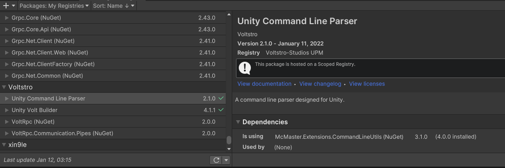

# UnityCommandLineParser

[](/LICENSE)
[](https://discord.voltstro.dev) 
[](https://www.youtube.com/Voltstro)

A command line parser designed for Unity.

One of the issues that plague most C# command line parsers is that they are designed to be run from `Program.Main(string[] args);` and basically take over as the entry point of your C# app. However, Unity doesn't have the standard C# entry point. So we created this project, a command line parser for Unity that is easy to use.

This project uses [McMaster.Extensions.CommandLineUtils](https://github.com/natemcmaster/CommandLineUtils) as its underlying parsing library and provides attributes to mark fields that can be filled out by an argument. You can use any field type that [CommandLineUtils](https://github.com/natemcmaster/CommandLineUtils/blob/main/src/CommandLineUtils/Abstractions/ValueParserProvider.cs) supports by default.

## Features

- Parses launch arguments when the player is launched.
- Supports commands and arguments

## Getting Started

### Package Installation

### Prerequisites

```
Unity 2020.3.x
```

[UnityNuGet](https://github.com/xoofx/UnityNuGet#unitynuget-) **MUST** be configured, as this project uses McMaster.Extensions.CommandLineUtils, which is a NuGet package.

### Voltstro-Studios UPM

You can install this package from our Azure UPM. Using a scoped registry will make updating a lot easier.

To add the registry, simply goto Edit -> Project Settings -> Package Manager, and add it to 'Scoped Registries' like so:


Or add it via your project's `manifest.json` file:

```json
{
    "scopedRegistries": [
        {
          "name": "Voltstro-Studios UPM",
          "url": "https://pkgs.dev.azure.com/Voltstro-Studios/UnityPackages/_packaging/UPM/npm/registry",
          "scopes": [
            "dev.voltstro"
          ]
        }
      ]
}
```

It will then appear in your package manage under 'My Registries', you can install it like any other Unity package.



### Git

1. Open up the package manager via Windows -> Package Manager
2. Click on the little + sign -> Add package from git URL...
3. Type `https://github.com/Voltstro-Studios/UnityCommandLineParser.git` and add it
4. Unity will now download and install the package

## Usage

Mark a static field with a `[CommandLineArgument]` attribute to be able to be set as a command line argument.

Or you can mark a static method with a `[CommandLineCommand]` attribute to be able to run a method as a command line argument.

### Examples

```csharp
[CommandLineArgument("name", "Sets the name of the player")]
public static string Name = "Voltstro";

[CommandLineArgument("fps", "Sets the fps of the game.")]
public static int Fps = 60;

[CommandLineCommand("weapons", "Adds all default weapons to the player on load")]
public static void AddDefaultWeapons()
{
     //Do some cool stuff
}
```

If this example was to be run with the commands: `./UnityPlayer -fps 420 -name "EternalClickbait Suxs" -weapons`, it would set the `Fps` variable to `420`, set the `Name` variable to `EternalClickbait Suxs` and run the method `AddDefaultWeapons()` on startup.

## Authors

**Voltstro** - *Initial Work* - [Voltstro](https://github.com/Voltstro)

## License

This project is licensed under the MIT License - see the [LICENSE.md](/LICENSE.md) file for details.
